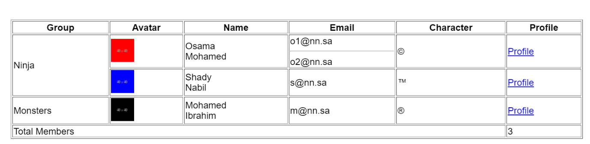

# Members Data Table

### Task 

Create an HTML table that displays members data according to the required specifications.
The table should be built using **HTML elements only**, without any CSS or JavaScript.

### Requirements

* The table must fill the entire screen.
* You can use any names and data you want.
* The image size must be **40 × 40**.
* Any link can be used, but it must open in a **new tab**.
* Only **HTML elements** are allowed to complete the task.
* The first name must be on one line and the last name on a new line below it.
* The first person has more than one email, separated by a horizontal line.
* Add a **caption** to the table with the text: `Members Data`.
* The final result must match the provided reference image.

# Nedded Table

